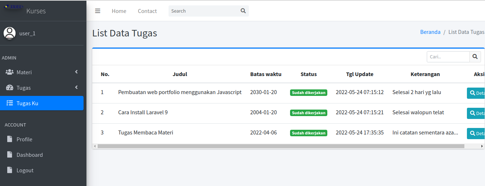

## Projek : Desaku 

Sebuah aplikasi Web Apps utk Memanaje Desa. 

### Lebih Detail:
- Dimulai: Pertengahan Jun-2025
- Dibuat menggunakan PHP Framework: Laravel versi 9.
- Menggunakan DB-MySQL.
- Admin template: AdminLTE3.
- FrontEnd template: EduStage dari ColorLib.
- Login/Logout MultiUser (Admin, Guru, Murid)
- User: admin // pass123
- User: user_1 // pass123
- User: staff_1 // pass123

## Snapshots:

